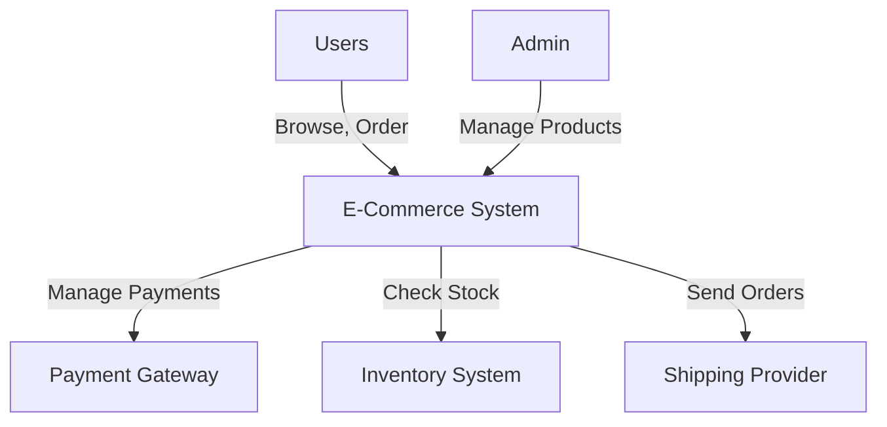

# Context Diagram: Explanation & Usage

## What is a Context Diagram?
A **Context Diagram** is a **high-level visual representation** of a system and its interactions with external entities such as users, databases, and third-party services. It provides a **bird’s-eye view** of the system’s boundaries and dependencies.

---

## Key Characteristics
- **High-level view** of the system.
- **No internal details**—only external entities and interactions.
- **Clear depiction of data flow** between the system and external components.
- **Useful for both technical and non-technical stakeholders.**

---

## Components of a Context Diagram
A context diagram typically consists of:

| Component        | Description |
|-----------------|------------|
| **System (Main Component)** | The core system being designed (e.g., "E-Commerce System"). |
| **External Entities** | Users, third-party services, databases, or APIs interacting with the system. |
| **Interactions** | Data flow between the system and external entities (e.g., requests, responses, transactions). |
| **Arrows** | Show the direction of interaction between the system and entities. |

---

## Example of a Context Diagram (Mermaid Format)
You can use **Mermaid** syntax to generate a **context diagram** in Markdown-supported platforms like GitHub, GitLab, and Confluence.

---

## Why Use a Context Diagram?
- ✅ **Simplifies complex systems** by focusing on external interactions.
- ✅ **Enhances communication** between business and technical teams.
- ✅ **Aids in requirement gathering** by defining key system boundaries.
- ✅ **Supports architectural decisions** by identifying dependencies early.

---

## When to Use a Context Diagram?
- 📌 During **initial system design** to define system boundaries.
- 📌 When **communicating system interactions** with stakeholders.
- 📌 In **architecture documentation** to provide a high-level overview.
- 📌 For **system integration planning** to analyze dependencies.

---

## Best Practices
✔️ Keep it **simple and clear**—avoid too much detail.  
✔️ Use **consistent naming** for system components.  
✔️ Show **only necessary interactions** to avoid clutter.  
✔️ Use **standard notation** for better readability.  

---

## Conclusion
A **Context Diagram** is an essential tool in software architecture that helps visualize the system's role within a larger environment. It is **especially useful for stakeholders** who need to understand how a system interacts with external entities without getting into technical complexities.

---
