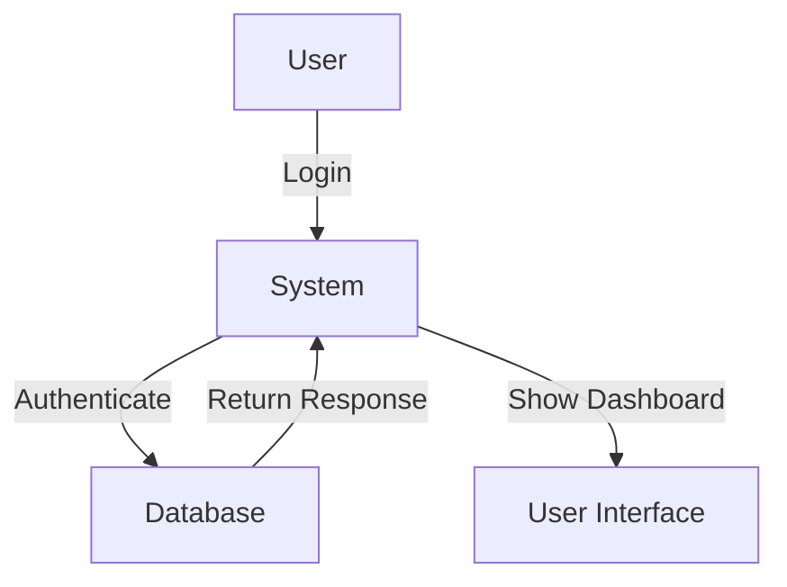
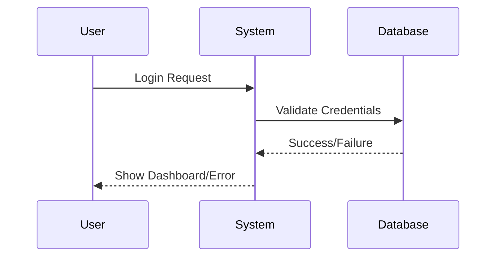

# What is Mermaid Syntax?

**Mermaid** is a **lightweight JavaScript-based markdown-like syntax** used for creating diagrams and visualizations directly within Markdown files. It enables users to generate **flowcharts, sequence diagrams, Gantt charts, and more** using simple text-based definitions.

---

## Where is Mermaid Used?

Mermaid is supported in various **platforms and tools**, including:

| **Platform/Tool**      | **Usage** |
|------------------------|-----------|
| **GitHub**            | Supports Mermaid for rendering diagrams in Markdown files (`.md`). |
| **GitLab**            | Supports Mermaid syntax in wikis, issues, and `.md` files. |
| **Confluence**        | Requires Mermaid Plugin to embed diagrams. |
| **Notion**            | Needs third-party integration or manual rendering. |
| **VS Code (with Extension)** | Enables live preview of Mermaid diagrams. |
| **Draw.io (Diagrams.net)** | Supports Mermaid for diagram creation. |
| **Obsidian (Markdown Notes)** | Uses Mermaid for diagramming in notes. |

---

## How to Use Mermaid?

### 1. Using Mermaid in GitHub Markdown
GitHub allows Mermaid diagrams inside Markdown files. Use **triple backticks (` ``` `) with `mermaid`** like this:

```markdown

```

### 2. Using Mermaid in GitLab
GitLab supports Mermaid in:
- `.md` files (Documentation)
- Wiki pages
- Issues & Merge Requests

Simply use:

```markdown

```

### 3. Using Mermaid in VS Code
- Install the **"Markdown Preview Mermaid Support"** extension.
- Create a `.md` file and add Mermaid syntax.
- Press `Ctrl + Shift + V` to preview.

---

## Common Mermaid Diagram Types

| **Diagram Type** | **Example Syntax** |
|-----------------|-----------------|
| **Flowchart** | `graph TD; A-->B; B-->C;` |
| **Sequence Diagram** | `sequenceDiagram; A->>B: Message;` |
| **Gantt Chart** | `gantt; section Work; Task1:done, 2023-01-01,2023-01-05;` |
| **Class Diagram** | `classDiagram; class User { +name +email }` |
| **State Diagram** | `stateDiagram; [*] --> Start; Start --> Running;` |

---

## Why Use Mermaid?

✅ **Easy to write** (No need for complex design tools)  
✅ **Lightweight & text-based** (Version control-friendly)  
✅ **Works in multiple platforms** (GitHub, GitLab, VS Code, Confluence)  
✅ **Supports automation** (Generate diagrams dynamically)  

---

## Conclusion

Mermaid is a powerful **text-to-diagram tool** that simplifies creating and maintaining **technical diagrams** in Markdown. It's perfect for **software architecture, workflows, and system documentation**. 🚀  

